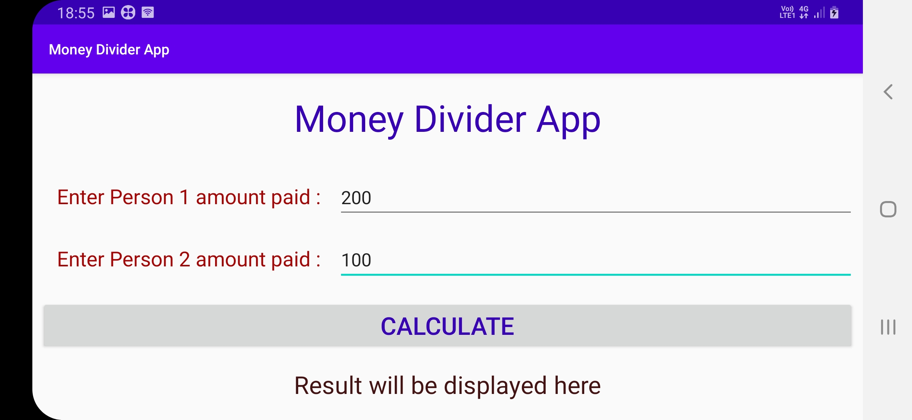

# Money Divider App
## Description
The key functionality of this Android App is to take input prices from two different users and then show the difference as result.

## Concept used

 This application is build with the help of View Model, Live Data, and Data Binding class. Whenever there is a configuration change occurs, such as screen rotation, activity is re-created, thus resulting text views to dismiss data and re-create it.
 This could be avoided with ViewModel. The data persists in the view model scope and it won't gets re-created on a configuration change. The code is made to follow clean code architecture.

## Final Product

* The following screenshots are taken from the application. Let this be the initial screen. Notice the text view contains an initial data.
  

* This screenshots are result when View model, Live data and Data Binding **IS NOT** being used. Notice in the second picture, the text view is re-created with initial data and calculated data is gone.
  

* This screenshots are result when View model, Live data and Data Binding **IS** being used. Notice in the second picture, the text view is still holding the caluclated data.
  

